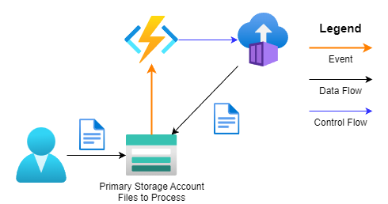

# File Processing Pipeline

Example project demonstraiting an automated workflow for file processing. Uploading a file triggers a containerized application that processes the file and writes results back to the storage account. 




# Getting Started

Configure the environment variables. Copy `example.env` to `.env` and update the values.

## Create System Identities

The solution use system identities to deploy cloud resources. The following table lists the system identities and their purpose.

| System Identities      | Authentication                                             | Authorization                                                                                                                                                                  | Purpose                                                                                                          |
| ---------------------- | ---------------------------------------------------------- | ------------------------------------------------------------------------------------------------------------------------------------------------------------------------------ | ---------------------------------------------------------------------------------------------------------------- |
| TBD| TBD | TBD| TBD |

```bash
# Configure the environment variables. Copy `example.env` to `.env` and update the values
cp example.env .env
# load .env vars
[ ! -f .env ] || export $(grep -v '^#' .env | xargs)
# or this version allows variable substitution and quoted long values
[ -f .env ] && while IFS= read -r line; do [[ $line =~ ^[^#]*= ]] && eval "export $line"; done < .env

# Login to az. Only required once per install.
az login --tenant $AZURE_TENANT_ID --use-device-code
```

## Provision Resources

Typical system requirements are:
* 32 or 64-bit compatible CPU. A processor operating at 2.0 GHz or faster is recommended.
* 2 GB RAM is recommended
* 10GB disk

```bash
# Shared Resources------------------------
# Container Registry
# Storage Account - Shared Artifacts
# Solution Resources-----------------------
# Azure Container Instance
# Storage Account - Application Working Files
# File Shares - Networked mapped working files
az storage share create \
    --account-name "$APP_STORAGE_ACCOUNT_NAME" \
    --account-key "$APP_STORAGE_KEY" \
    --name share

# Function App
az functionapp config appsettings set \
    --name "$FUNC_APP_NAME" \
    --resource-group "$FUNC_APP_RG" \
    --settings "APP_STORAGE_CONNECTION=$APP_STORAGE_CONNECTION" \
        "APP_STORAGE_CONTAINER=$APP_STORAGE_CONTAINER" \
        "APP_STORAGE_INPUT_PATH=$APP_STORAGE_INPUT_PATH" \
        "APP_STORAGE_OUTPUT_PATH=$APP_STORAGE_OUTPUT_PATH"
        
# Event Grid
az provider register --namespace Microsoft.EventGrid
az provider show --namespace Microsoft.EventGrid --query "registrationState"

app_storageid=$(az storage account show --name "$APP_STORAGE_ACCOUNT_NAME" --resource-group "$APP_STORAGE_RG" --query id --output tsv)
az eventgrid event-subscription create \
    --source-resource-id "$app_storageid" \
    --name "$EVENT_SUBSCRIPTION_NAME" \
    --endpoint "$FUNC_APP_ENDPOINT"
```

This approach uses a centralized artifact store for binaries. Blob storage account is the artifact store
```bash
# Download your binary that needs to be deployed in the container as ARTIFACT_NAME. 
curl /path/to/files -o "$ARTIFACT_NAME"
# Upload to a shared artifact location in blob storage
az storage blob upload \
    --account-name "$ARTIFACT_STORAGE_ACCOUNT" \
    --container-name "$ARTIFACT_CONTAINER" \
    --name "$ARTIFACT_NAME" \
    --file "$ARTIFACT_NAME"
```

## Build and Deploy the Artifact

The build pipeline
* Fetch artifact
* Build image
* Publish Image
* Deploy Configs
* Deploy Container

### Fetch Artifact
```bash
# Get Artifact Storage SAS Key
set +e
ARTIFACT_SAS_TOKEN=$(az storage container generate-sas \
    --account-name "$ARTIFACT_STORAGE_ACCOUNT" \
    --name "$ARTIFACT_CONTAINER" \
    --permission r \
    --expiry $(date -u -d "1 hour" '+%Y-%m-%dT%H:%MZ') \
    --auth-mode login \
    --as-user \
    --output tsv 2>&1)
set -e

artifact_path="https://${ARTIFACT_STORAGE_ACCOUNT}.blob.core.windows.net/${ARTIFACT_CONTAINER}/${ARTIFACT_FOLDER}/${ARTIFACT_NAME}?${ARTIFACT_SAS_TOKEN}"

rm -Rf .artifact_cache
mkdir -p .artifact_cache
curl -fsSL "${artifact_path}" -o "${ARTIFACT_NAME}"
unzip -q "${ARTIFACT_NAME}" -d .artifact_cache
```

### Build docker image
```bash
# Configure image version
model_name="$MODEL_NAME"
model_version="$MODEL_VERSION"
image="${model_name}_v${model_version}"

proj_version="${PROJ_VERSION}"
build_number=$(date +%Y%m%dT%H%M)
version="${proj_version}.dev${build_number}"

image_name="${image}:${version}"

project_root=$(git rev-parse --show-toplevel)
dockerfile_path="${project_root}/pipeline_app/Dockerfile"

# Build image
DOCKER_BUILDKIT=1 docker buildx build \
    --platform linux/amd64 \
    --build-arg "RELEASE_VERSION=$version" \
    --build-arg "APP_INSTALLER_FILE=$APP_INSTALLER_FILE" \
    --build-arg "APP_FILE=$APP_FILE" \
    --build-arg "APP_SETUP_ARGS=$APP_SETUP_ARGS"  \
    --build-arg "APP_ALIAS=$APP_ALIAS" \
    -t "$image_name" -f "${dockerfile_path}" "${project_root}"
```

### Push image

```bash
# Login to remote registry
docker login -u "$CONTAINER_REGISTRY_USERNAME" -p "$CONTAINER_REGISTRY_PASSWORD" "${CONTAINER_REGISTRY_NAME}.azurecr.io"

# Tag image
docker tag "${image}:${version}" "${image}:latest"
docker tag "${image}:${version}" "${CONTAINER_REGISTRY_NAME}.azurecr.io/${CONTAINER_REGISTRY_NAMESPACE}/${image}:${version}"
docker tag "${image}:latest" "${CONTAINER_REGISTRY_NAME}.azurecr.io/${CONTAINER_REGISTRY_NAMESPACE}/${image}:latest"

docker push "${CONTAINER_REGISTRY_NAME}.azurecr.io/${CONTAINER_REGISTRY_NAMESPACE}/${image}:${version}"
docker push "${CONTAINER_REGISTRY_NAME}.azurecr.io/${CONTAINER_REGISTRY_NAMESPACE}/${image}:latest"
```

### Deploy Configs
```bash
# Copy app configs to storage share
az storage file upload \
    --source "$LOCAL_APP_RUNTIME_CONFIG_FILE" \
    --share-name share \
    --account-key "$APP_STORAGE_KEY" \
    --account-name "$APP_STORAGE_ACCOUNT_NAME"

az storage file upload \
    --source "$LOCAL_APP_EXPORT_CONFIG_FILE" \
    --share-name share \
    --account-key "$APP_STORAGE_KEY" \
    --account-name "$APP_STORAGE_ACCOUNT_NAME"
```

### Deploy to Azure Container Instance
```bash
# Remove previous
az container delete \
    --resource-group "$ACI_RESOURCE_GROUP" \
    --name "$ACI_NAME" \
    --yes

# Create new instance
az container create \
    --resource-group "$ACI_RESOURCE_GROUP" \
    --name "$ACI_NAME" \
    --image "${CONTAINER_REGISTRY_NAME}.azurecr.io/${CONTAINER_REGISTRY_NAMESPACE}/${image}:${version}" \
    --cpu 1 --memory 2 \
    --restart-policy Never \
    --os-type Linux \
    --registry-login-server "${CONTAINER_REGISTRY_NAME}.azurecr.io" \
    --registry-username "$CONTAINER_REGISTRY_USERNAME" \
    --registry-password "$CONTAINER_REGISTRY_PASSWORD" \
    --azure-file-volume-account-name $APP_STORAGE_ACCOUNT_NAME \
    --azure-file-volume-account-key $APP_STORAGE_KEY \
    --azure-file-volume-share-name "share" \
    --azure-file-volume-mount-path /mnt/azurefiles \
    --environment-variables \
        APP_RUNTIME_CONFIG_FILE="$APP_RUNTIME_CONFIG_FILE" \
        APP_EXPORT_CONFIG_FILE="$APP_EXPORT_CONFIG_FILE" \
        APP_LOG_FILE="$APP_LOG_FILE"
```

# Development

Use the following commands to setup your environment.

```bash
# Configure the environment variables. Copy example.env to .env and update the values
cp example.env .env

# load .env vars
# [ ! -f .env ] || export $(grep -v '^#' .env | xargs)
# or this version allows variable substitution and quoted long values
# [ -f .env ] && while IFS= read -r line; do [[ $line =~ ^[^#]*= ]] && eval "export $line"; done < .env

# Create and activate a python virtual environment
# Windows
# C:\Users\!Admin\AppData\Local\Programs\Python\Python312\python.exe -m venv .venv
# .venv\scripts\activate

# Linux
python3.12 -m venv .venv
source .venv/bin/activate

# Update pip
python -m pip install --upgrade pip

# Install dependencies
pip install -r requirements_dev.txt
```
## Running the Application

Run the application locally after building the image.

```bash
# Run container locally
docker run -p 5000:5000 "$image_name"

# Run locally with Interactive shell
docker run -it --entrypoint /bin/bash -p 5000:5000  "$image_name"
```

Once your container instance has been deployed, you can manually start it and connect for interactive debugging or runtime inspection.

> **Prerequisite**  
> Ensure your user or service principal has the following Azure role:  
> **`Microsoft.ContainerInstance/containerGroups/start/action`**  
> **`Microsoft.ContainerInstance/containerGroups/containers/exec/action`** 
> **`Microsoft.ContainerInstance/containerGroups/restart/action`**   
> These permission are included in the **Contributor** or **Azure Container Instance Contributor** roles.

```bash
# If the container is in a **Terminated** or **Stopped** state, use the following command to start it:
az container start \
    --resource-group "$ACI_RESOURCE_GROUP" \
    --name "$ACI_NAME" 

# Connect to the Running Container with an Interactive shell
az container exec \
  --resource-group "$ACI_RESOURCE_GROUP" \
  --name "$ACI_NAME" \
  --exec-command "/bin/bash"

az container show \
    --resource-group "$ACI_RESOURCE_GROUP" \
    --name "$ACI_NAME" \
    --query 'containers[0].instanceView.currentState.state'
```

## Style Guidelines

Summary of the most relevant points:

- Comments should be full sentences and end with a period.
- Constants and the content of lists and dictionaries should be in alphabetical order.
- It is advisable to adjust IDE or editor settings to match those requirements.

## Testing

```bash
# Run linters outside of pre-commit
codespell
shellcheck -x *.sh
```

# Notes

Various notes.

## Mounting network files in docker 

* At image build time
* At container create time
* At run time

```bash
# Get network storage key 
set +e
APP_STORAGE_KEY=$(az storage account keys list \
    --resource-group "$APP_STORAGE_RG" \
    --account-name "$APP_STORAGE_ACCOUNT_NAME" \
    --query "[0].value" \
    --output tsv 2>&1)
set -e

# At Docker Build Time -----------------------------------------------------------------------------------
echo "$APP_STORAGE_KEY" > storage_key.txt
DOCKER_BUILDKIT=1 docker buildx build \
    --secret id=storage_key,src=storage_key.txt \
    --build-arg "RELEASE_VERSION=$version" \
    --build-arg "APP_STORAGE_ACCOUNT_NAME=$APP_STORAGE_ACCOUNT_NAME" \
    --build-arg "APP_INSTALLER_FILE=$APP_INSTALLER_FILE" \
    --build-arg "APP_FILE=$APP_FILE" \
    --build-arg "APP_SETUP_ARGS=$APP_SETUP_ARGS"  \
    -t "$image_name" -f "${dockerfile_path}" "${project_root}"
rm storage_key.txt

# Docker file has
RUN --mount=type=secret,id=storage_key mount -t cifs "//${APP_STORAGE_ACCOUNT_NAME}.file.core.windows.net/share" \
        /mnt/azurefiles \
        -o "vers=3.0,username=${APP_STORAGE_ACCOUNT_NAME},password=$(cat /run/secrets/storage_key),dir_mode=0777,file_mode=0777,serverino"

# At Container Create Time - Via Mounting fileshare
az container create \
    ... \
    --azure-file-volume-account-name $APP_STORAGE_ACCOUNT_NAME \
    --azure-file-volume-account-key $APP_STORAGE_KEY \
    --azure-file-volume-share-name "share" \
    --azure-file-volume-mount-path /mnt/azurefiles


# At Run Time - mount on host and run with volume ------------------------------------------------
sudo mkdir -p /mnt/azurefiles 
sudo mount -t cifs //${APP_STORAGE_ACCOUNT_NAME}.file.core.windows.net/share \
    /mnt/azurefiles \
    -o "vers=3.0,username=${APP_STORAGE_ACCOUNT_NAME},password="$APP_STORAGE_KEY",dir_mode=0777,file_mode=0777,serverino"

docker run -p 5000:5000 -v /mnt/azurefiles:/mnt/azurefiles "$image_name"

# Interactive shell
docker run -it --entrypoint /bin/bash -p 5000:5000  -v /mnt/azurefiles:/mnt/azurefiles "$image_name"

```

## Azure Key Vault

General use
```bash
# Verify RBAC auth
az keyvault show \
    --name "$KEY_VAULT_NAME" \
    --query properties.enableRbacAuthorization

# Set role to a user - Dev only use case
assignee_id=$(az ad signed-in-user show --query id -o tsv)
az role assignment create \
  --role "Key Vault Secrets Officer" \
  --assignee "$assignee_id" \
  --scope $(az keyvault show --name "$KEY_VAULT_NAME" --query id -o tsv)
```

Storing and getting secrets
```bash

# Secret name
acr_password_name="acr-${CONTAINER_REGISTRY_NAME}-${CONTAINER_REGISTRY_USERNAME}-password"

# Set ACR password
az keyvault secret set \
    --vault-name "$KEY_VAULT_NAME" \
    --name "$acr_password_name" \
    --value "$CONTAINER_REGISTRY_PASSWORD"

# Get ACR password
CONTAINER_REGISTRY_PASSWORD=$(az keyvault secret show --vault-name "$KEY_VAULT_NAME" --name "$acr_password_name" --query value -o tsv)
```
